# 🏗️ CI/CD Architecture

## System Overview

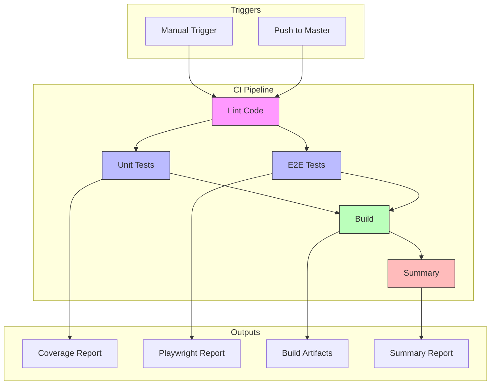

---

## Job Flow

### Sequential Dependencies

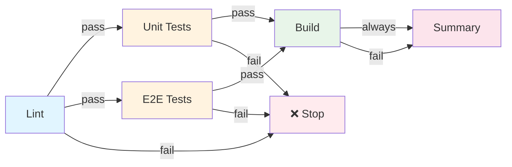

### Parallel Execution

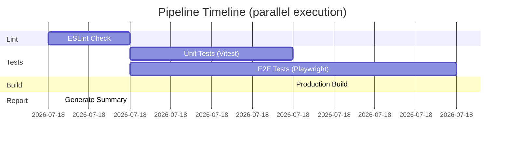

---

## Technology Stack

### CI/CD Platform
- **GitHub Actions** - Cloud-based CI/CD
- **Ubuntu Latest** - Runner OS
- **Node.js 20 LTS** - Runtime

### Testing Framework
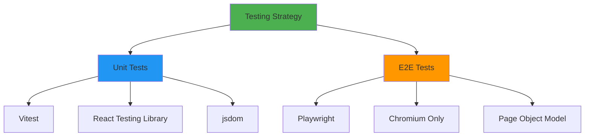

### Quality Gates

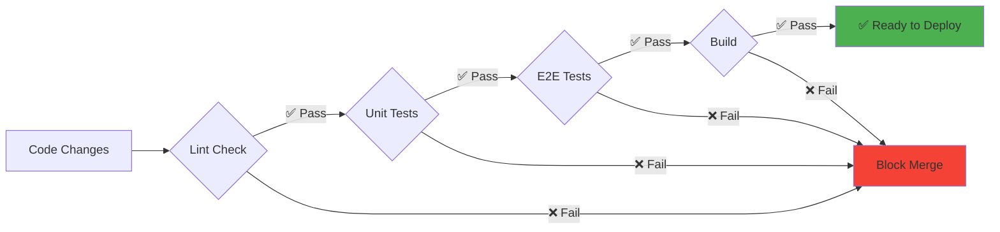

---

## Cache Strategy

### Node Modules Cache

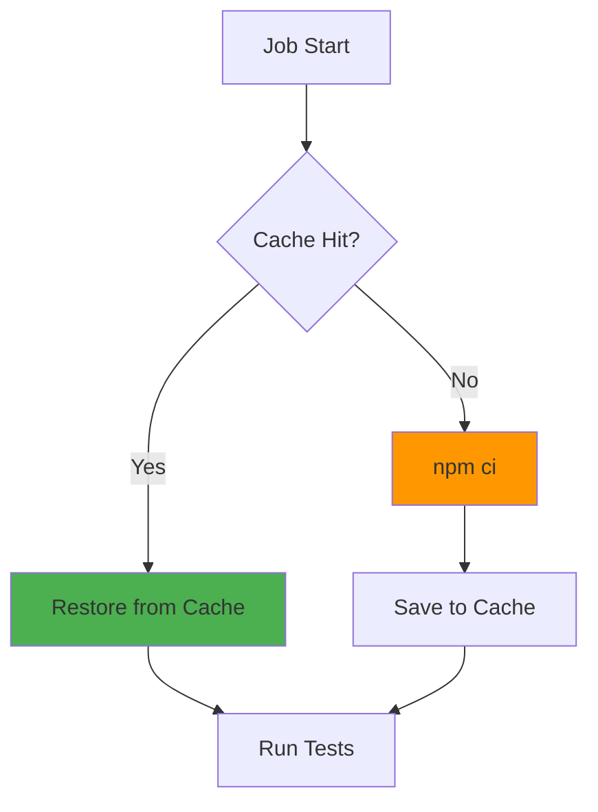

**Benefits:**
- ⚡ 10x faster dependency installation
- 💰 Reduced network usage
- 🚀 Faster pipeline execution

**Cache Key:**
```yaml
key: ${{ runner.os }}-node-${{ hashFiles('**/package-lock.json') }}
```

---

## Secrets Management

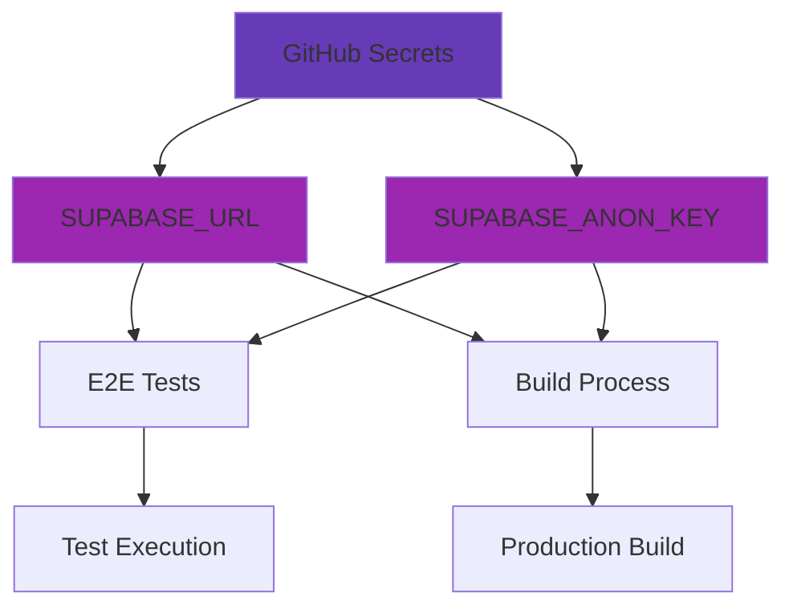

**Security:**
- ✅ Encrypted at rest
- ✅ Masked in logs
- ✅ Limited access (repo admins only)
- ✅ No exposure in artifacts

---

## Artifact Management

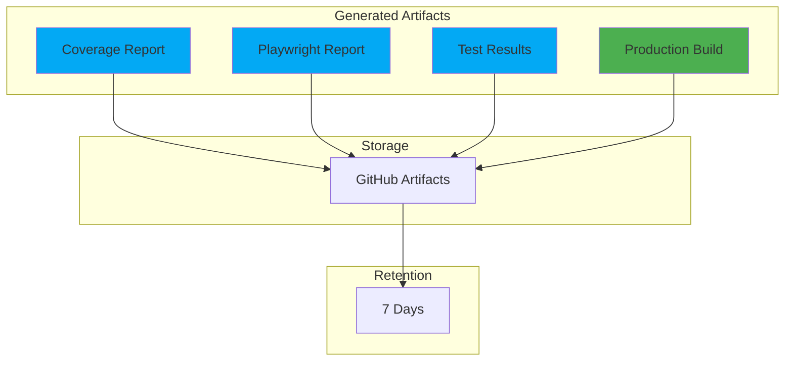

**Storage Allocation:**
- Coverage Report: ~5-10 MB
- Playwright Report: ~50-100 MB (with screenshots/videos)
- Test Results: ~10-50 MB
- Production Build: ~20-50 MB
- **Total per run: ~100-200 MB**

---

## Performance Optimization

### Job Parallelization

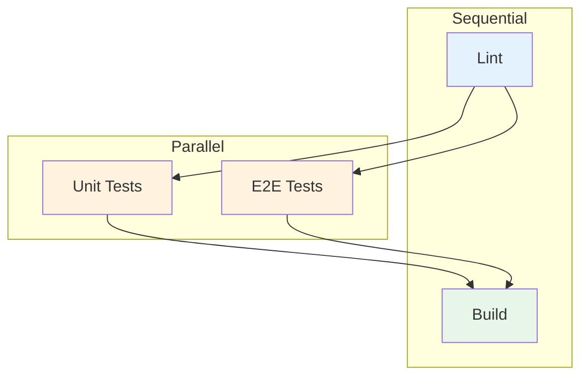

**Time Savings:**
- Without parallelization: ~7-10 min
- With parallelization: ~5-8 min
- **Improvement: 25-30%**

### Best Practices Applied

1. **Cache Dependencies**
   - npm packages cached between runs
   - Playwright browsers cached

2. **Parallel Execution**
   - Unit and E2E tests run simultaneously
   - Independent jobs don't wait

3. **Fail Fast**
   - Lint fails → stop early
   - Save time on obvious failures

4. **Minimal Retries**
   - 2 retries in CI (flaky tests)
   - 0 retries locally

---

## Error Handling

### Failure Scenarios

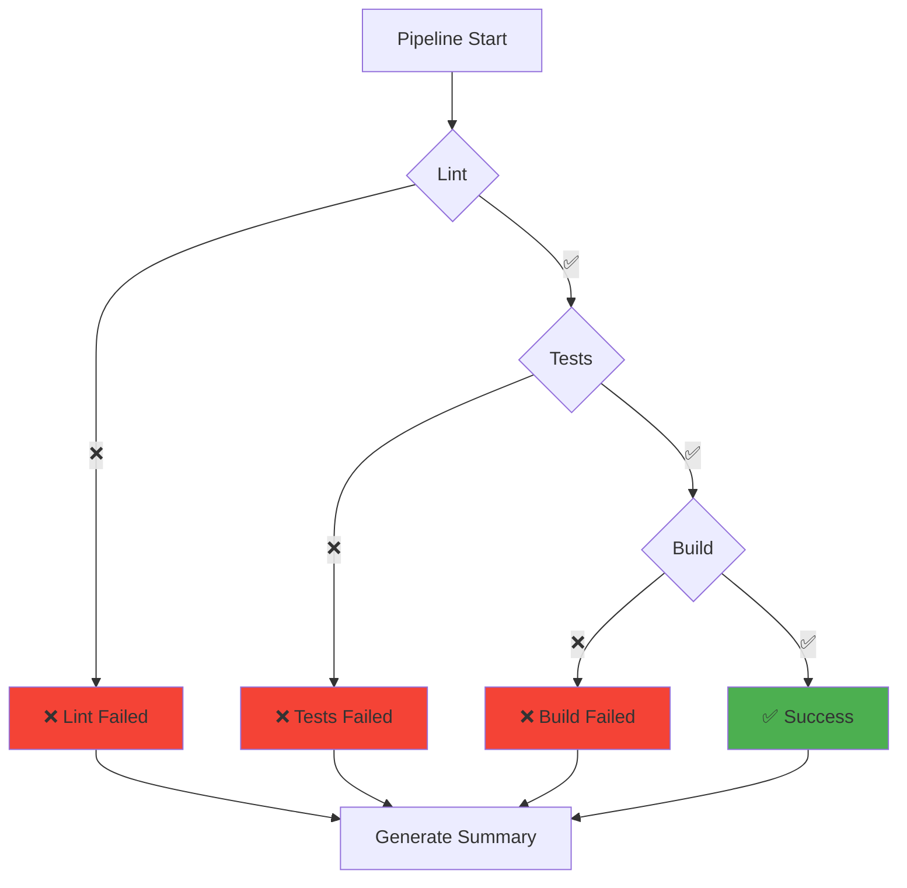

### Recovery Strategies

| Failure | Detection | Recovery | Prevention |
|---------|-----------|----------|------------|
| Lint Error | ESLint | `npm run lint:fix` | Pre-commit hooks |
| Unit Test Fail | Vitest | Fix test/code | TDD approach |
| E2E Test Fail | Playwright | Check trace viewer | Stable selectors |
| Build Fail | Astro | Fix imports/deps | Local testing |

---

## Monitoring & Observability

### Metrics Tracked

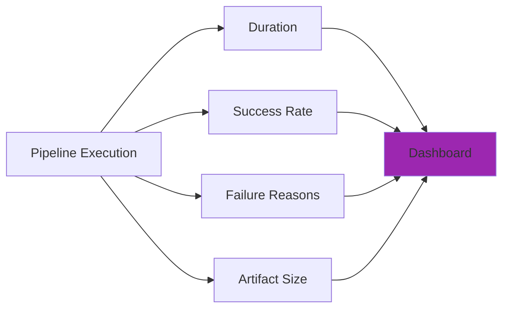

### Key Performance Indicators (KPIs)

| Metric | Target | Current | Status |
|--------|--------|---------|--------|
| Pipeline Duration | < 10 min | 5-8 min | ✅ |
| Success Rate | > 95% | TBD | 🟡 |
| Cache Hit Rate | > 80% | TBD | 🟡 |
| Artifact Upload Time | < 1 min | TBD | 🟡 |

---

## Future Enhancements

### Phase 2 (Optional)

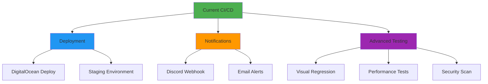

### Potential Additions

1. **Continuous Deployment**
   - Auto-deploy to staging on merge
   - Manual approval for production

2. **Enhanced Monitoring**
   - Slack/Discord notifications
   - Custom metrics dashboard

3. **Security Scanning**
   - Dependency vulnerability scan
   - SAST (Static Application Security Testing)

4. **Performance Testing**
   - Lighthouse CI integration
   - Bundle size tracking

---

## Cost Analysis

### GitHub Actions Usage

| Plan | Minutes/Month | Cost | Current Usage |
|------|---------------|------|---------------|
| Free (Public) | Unlimited | $0 | ✅ Recommended |
| Free (Private) | 2,000 | $0 | ✅ Sufficient |
| Pro | 3,000 | $4/mo | ⚠️ If needed |
| Team | 10,000 | $21/mo | ⚠️ If needed |

**Estimated Usage:**
- Average run: 5-8 minutes
- Runs per day: 10-20 (assuming active development)
- Monthly usage: ~800-2,400 minutes
- **Result: Free tier sufficient** ✅

---

## Compliance & Security

### Data Flow

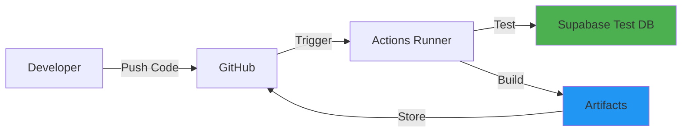

### Security Measures

- ✅ Secrets encrypted in GitHub
- ✅ No secrets in logs or artifacts
- ✅ Minimal permissions for runner
- ✅ Isolated test environment
- ✅ Branch protection enabled
- ✅ Required status checks

---

## Documentation Structure

```
.github/
├── workflows/
│   ├── ci.yml                 # Main workflow definition
│   └── README.md              # Detailed documentation
├── CI-CD-QUICK-START.md      # Quick start guide
├── SETUP-CHECKLIST.md        # Setup verification checklist
└── ARCHITECTURE.md           # This file (architecture details)
```

---

**Last Updated:** 2025-10-28  
**Version:** 1.0.0  
**Status:** ✅ Production Ready

