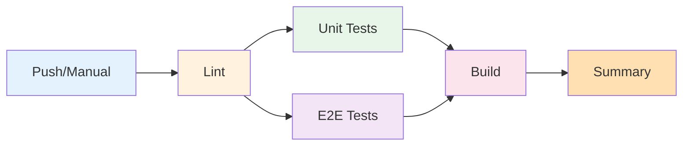

# 📚 GitHub Configuration & CI/CD Documentation

Witaj w dokumentacji CI/CD dla projektu **10x-cards**!

## 🗂️ Spis Treści

### 🚀 Start Tutaj

| Dokument | Opis | Czas Czytania |
|----------|------|---------------|
| [**CI-CD-QUICK-START.md**](CI-CD-QUICK-START.md) | Szybki start w 3 krokach | 5 min |
| [**CI-CD-SUMMARY.md**](CI-CD-SUMMARY.md) | Kompletne podsumowanie implementacji | 10 min |

### 📖 Dokumentacja Szczegółowa

| Dokument | Dla Kogo | Czas Czytania |
|----------|----------|---------------|
| [**workflows/README.md**](workflows/README.md) | Programiści, DevOps | 15 min |
| [**SETUP-CHECKLIST.md**](SETUP-CHECKLIST.md) | Team Lead, QA | 10 min |
| [**ARCHITECTURE.md**](ARCHITECTURE.md) | Architekci, Senior Devs | 20 min |
| [**SUPABASE-CI-OPTIONS.md**](SUPABASE-CI-OPTIONS.md) | Wszyscy (jeśli lokalny Docker) | 10 min |

### ⚙️ Pliki Konfiguracyjne

| Plik | Opis |
|------|------|
| [**workflows/ci.yml**](workflows/ci.yml) | Główny workflow GitHub Actions |
| [**copilot-instructions.md**](copilot-instructions.md) | Instrukcje dla GitHub Copilot |

---

## 🎯 Wybierz Swoją Ścieżkę

### 👨‍💻 Jestem Programistą
```
1. Przeczytaj: CI-CD-QUICK-START.md (5 min)
2. Ustaw: GitHub Secrets (5 min)
3. Uruchom: Manualny workflow (2 min)
4. Gotowe! Możesz pracować
```

### 👨‍🔧 Jestem DevOps/Admin
```
1. Przeczytaj: CI-CD-SUMMARY.md (10 min)
2. Sprawdź: workflows/README.md (15 min)
3. Zweryfikuj: SETUP-CHECKLIST.md (10 min)
4. Zrozum: ARCHITECTURE.md (20 min)
5. Skonfiguruj: Branch protection, secrets, etc.
```

### 👨‍💼 Jestem Team Lead/Manager
```
1. Przeczytaj: CI-CD-SUMMARY.md (10 min)
2. Sprawdź: SETUP-CHECKLIST.md (5 min)
3. Zrozum: Metryki i koszty w ARCHITECTURE.md
4. Zdecyduj: Jakie rozszerzenia są potrzebne
```

---

## 📊 Szybkie Fakty

```yaml
Platform: GitHub Actions
Czas Wykonania: 5-8 minut
Jobs: 5 (lint, test-unit, test-e2e, build, summary)
Artifacts: 4 (coverage, playwright-report, test-results, dist)
Retention: 7 dni
Koszt: Free dla public repo, ~2,100 min/miesiąc dla private
Status: ✅ Production Ready
```

---

## 🚀 Pierwsze Kroki (TL;DR)

### 1. Konfiguracja (5 minut)

```bash
# GitHub UI:
Settings > Secrets and variables > Actions > New repository secret

Name: SUPABASE_URL
Value: https://your-project.supabase.co

Name: SUPABASE_ANON_KEY  
Value: your-anon-key-here
```

### 2. Test Manualny (2 minuty)

```bash
# GitHub UI:
Actions > CI/CD Pipeline > Run workflow > Run workflow
```

### 3. Test Automatyczny

```bash
git add .
git commit -m "test: verify CI/CD"
git push origin master  # CI uruchomi się automatycznie
```

---

## 📋 Pipeline Overview



### Jobs Breakdown

| Job | Tool | Time | Blocking |
|-----|------|------|----------|
| 🔍 Lint | ESLint | ~30s | ✅ Yes |
| 🧪 Unit Tests | Vitest | ~1-2min | ✅ Yes |
| 🎭 E2E Tests | Playwright | ~2-3min | ✅ Yes |
| 🏗️ Build | Astro | ~1-2min | ✅ Yes |
| 📊 Summary | Shell | ~5s | ⚠️ Always runs |

---

## 🔗 Quick Links

### Dokumentacja Projektu
- [Main README](../README.md)
- [Testing Guide](../test/README.md)
- [Test Examples](../test/EXAMPLES.md)

### External Resources
- [GitHub Actions Docs](https://docs.github.com/en/actions)
- [Playwright Docs](https://playwright.dev)
- [Vitest Docs](https://vitest.dev)
- [Astro Docs](https://docs.astro.build)

### Supabase
- [Supabase Dashboard](https://supabase.com/dashboard)
- [Supabase Docs](https://supabase.com/docs)

---

## 🆘 Need Help?

### Common Issues

| Problem | Solution | Doc |
|---------|----------|-----|
| "SUPABASE_URL not defined" | Add GitHub Secret | Quick Start |
| "Tests failing in CI" | Check logs, test locally | workflows/README.md |
| "Build takes too long" | Check optimization tips | ARCHITECTURE.md |
| "Need to add deployment" | See Phase 2 extensions | CI-CD-SUMMARY.md |

### Support Channels

1. **Documentation** - Sprawdź docs powyżej
2. **GitHub Issues** - Zgłoś bug lub feature request
3. **Team** - Skontaktuj się z DevOps

---

## 📝 Change Log

### Version 1.0.0 (2025-10-28)
- ✅ Initial CI/CD setup
- ✅ Lint, Unit Tests, E2E Tests, Build
- ✅ Artifacts and reporting
- ✅ Complete documentation
- ✅ Mermaid diagrams
- ✅ Setup checklist
- ✅ Quick start guide

### Planned Features (Phase 2)
- 🔄 Continuous Deployment
- 🔔 Discord/Slack notifications
- 🔒 Security scanning
- 📊 Performance testing
- 📈 Advanced metrics

---

## ✅ Verification

Sprawdź czy wszystko działa:

```bash
# 1. Syntax check
npx js-yaml .github/workflows/ci.yml

# 2. Local tests
npm run lint
npm run test:run
npm run test:e2e
npm run build

# 3. GitHub Actions
# Actions > Run workflow > Check results
```

---

## 📞 Contact

**CI/CD Maintainer:** DevOps Team  
**Created:** 2025-10-28  
**Last Updated:** 2025-10-28  
**Version:** 1.0.0  
**Status:** ✅ Production Ready

---

**Dziękujemy za korzystanie z naszego CI/CD!** 🚀

Jeśli masz pytania lub sugestie, otwórz issue w repozytorium.

