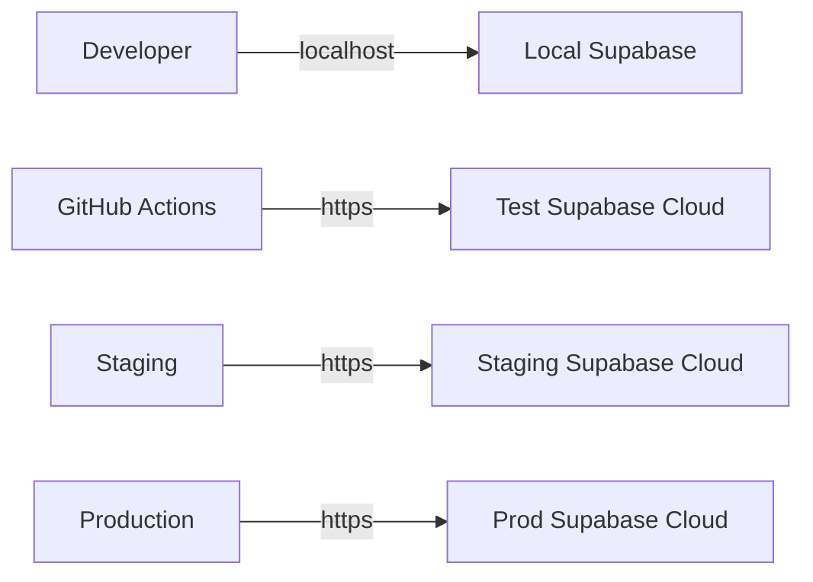

# 🗄️ Supabase w CI/CD - Opcje Konfiguracji

## Sytuacja: Lokalne Supabase na Dockerze

Jeśli używasz **lokalnego Supabase** (Docker Compose) do developmentu, musisz zdecydować jak skonfigurować Supabase dla CI/CD.

---

## 🤔 Problem

Twoje lokalne Supabase:
```env
SUPABASE_URL=http://localhost:54321
SUPABASE_ANON_KEY=eyJhbGciOiJIUzI1NiIsInR5cCI6IkpXVCJ9...
```

**NIE zadziała w GitHub Actions** bo:
- GitHub Actions runner to zdalny serwer
- Nie ma dostępu do twojego `localhost`
- Każdy job w CI to izolowany kontener

---

## ✅ Rozwiązania

### Opcja 1: Cloud Supabase (ZALECANE) ⭐

**Gdy używać:**
- Najprostsza konfiguracja
- Chcesz szybko uruchomić CI/CD
- Nie masz specjalnych wymagań
- Wystarczy free tier Supabase

**Jak skonfigurować:**

#### 1. Stwórz dedykowany projekt testowy w Supabase Cloud

```bash
# Przejdź do: https://supabase.com/dashboard
# Kliknij: "New project"

Nazwa: 10x-cards-test  (lub 10x-cards-ci)
Database Password: <silne-hasło>
Region: Najbliższy ci
Plan: Free
```

#### 2. Uruchom migracje na projekcie testowym

```bash
# Podlinkuj do projektu testowego
supabase link --project-ref <test-project-ref>

# Uruchom migracje
supabase db push

# Opcjonalnie: Seed z danymi testowymi
psql $DATABASE_URL < test-seed.sql
```

#### 3. Ustaw GitHub Secrets

```
Settings > Secrets > Actions

Name: SUPABASE_URL
Value: https://twoj-test-projekt.supabase.co

Name: SUPABASE_ANON_KEY
Value: <anon-key-z-test-projektu>
```

#### 4. Lokalne vs CI environment

```env
# .env (development - lokalny Docker)
SUPABASE_URL=http://localhost:54321
SUPABASE_ANON_KEY=<local-anon-key>

# GitHub Secrets (CI - cloud)
SUPABASE_URL=https://test-projekt.supabase.co
SUPABASE_ANON_KEY=<cloud-test-anon-key>
```

**Zalety:**
- ✅ Najprostsza konfiguracja (5 minut)
- ✅ Szybkie wykonanie testów
- ✅ Nie trzeba instalować Dockera w CI
- ✅ Izolacja od produkcji
- ✅ Persistence między runami (jeśli potrzebne)

**Wady:**
- ⚠️ Potrzebujesz drugiego projektu Supabase
- ⚠️ Dane testowe w chmurze (nie lokalnie)
- ⚠️ Może być inny stan niż lokalnie

**Koszt:**
- Free tier wystarczy dla CI (2GB transfer/miesiąc)

---

### Opcja 2: Lokalny Supabase w CI (Docker)

**Gdy używać:**
- Chcesz mieć identyczne środowisko dev/CI
- Nie chcesz drugiego projektu Supabase
- Masz czas na bardziej skomplikowaną konfigurację
- Dane testowe nie mogą wychodzić na zewnątrz

**Jak skonfigurować:**

#### 1. Użyj przykładowego workflow

Skopiuj `.github/workflows/ci-with-local-supabase.yml.example` → `ci.yml`

#### 2. Workflow uruchomi Supabase automatycznie

```yaml
- name: Start Supabase locally
  run: |
    supabase start
    echo "SUPABASE_URL=$(supabase status --output json | jq -r '.API_URL')" >> $GITHUB_ENV
```

#### 3. Nie potrzebujesz GitHub Secrets!

Supabase jest uruchamiany w CI, więc URL i klucze są generowane automatycznie.

**Zalety:**
- ✅ Identyczne środowisko dev/CI
- ✅ Nie potrzebujesz cloud Supabase
- ✅ Pełna kontrola nad danymi
- ✅ Zawsze świeża, czysta baza

**Wady:**
- ⚠️ Bardziej skomplikowana konfiguracja
- ⚠️ Dłuższe wykonanie (+2-3 minuty na start Supabase)
- ⚠️ Wymaga Docker w GitHub Actions
- ⚠️ Trudniejsze debugowanie

**Koszt:**
- Zużywa więcej minut GitHub Actions (~+30%)

---

### Opcja 3: Hybrydowe (Dev Local + Test Cloud)

**Gdy używać:**
- Chcesz najlepsze z obu światów
- Programiści pracują lokalnie (szybko)
- CI używa cloud (stabilnie)

**Jak skonfigurować:**

```bash
# Lokalne środowisko (developer)
docker-compose up  # Supabase lokalnie

# Środowiska cloud
Production:  10x-cards-prod.supabase.co
Staging:     10x-cards-staging.supabase.co
Test/CI:     10x-cards-test.supabase.co
```

**Workflow:**


**Zalety:**
- ✅ Szybki development (lokalnie)
- ✅ Stabilne CI (cloud)
- ✅ Proper environments separation
- ✅ Elastyczność

**Wady:**
- ⚠️ Więcej projektów do zarządzania
- ⚠️ Trzeba pilnować sync migracji

---

## 🎯 Rekomendacja

### Dla Twojego Projektu: **Opcja 1 (Cloud Supabase)** ⭐

**Dlaczego:**
1. Minimalny setup CI/CD (zgodnie z wymaganiem)
2. Szybkie uruchomienie (5 minut)
3. Proste w utrzymaniu
4. Free tier wystarczy

**Kroki:**

```bash
# 1. Stwórz projekt test w Supabase Dashboard
# Nazwa: 10x-cards-test

# 2. Podlinkuj lokalnie do test projektu
supabase link --project-ref <test-ref>

# 3. Push migracje
supabase db push

# 4. Pobierz credentials
supabase status

# 5. Ustaw GitHub Secrets
# SUPABASE_URL i SUPABASE_ANON_KEY

# 6. Test CI
git push origin master
```

**Czas: ~10 minut**

---

## 📝 Porównanie

| Feature | Cloud (Opcja 1) | Local (Opcja 2) | Hybrid (Opcja 3) |
|---------|----------------|-----------------|------------------|
| **Setup Time** | 10 min ⚡ | 30 min | 20 min |
| **CI Duration** | 5-8 min ⚡ | 8-12 min | 5-8 min ⚡ |
| **Complexity** | Low ⚡ | High | Medium |
| **Dev/CI Parity** | Medium | High ⚡ | High ⚡ |
| **Cost** | Free tier | Free (more mins) | Free tier |
| **Maintenance** | Low ⚡ | Medium | Medium |
| **Debugging** | Easy ⚡ | Hard | Easy ⚡ |

⚡ = Lepsze

---

## 🔧 Konfiguracja dla Opcji 1 (Step-by-step)

### Krok 1: Stwórz Test Project w Supabase

1. Przejdź do: https://supabase.com/dashboard
2. Kliknij: **"New project"**
3. Wypełnij:
   ```
   Organization: <wybierz swoją>
   Name: 10x-cards-test
   Database Password: <wygeneruj silne hasło>
   Region: <wybierz najbliższy>
   Pricing Plan: Free
   ```
4. Kliknij: **"Create new project"**
5. Poczekaj ~2 minuty aż projekt się utworzy

### Krok 2: Uruchom Migracje

```bash
# Terminal w twoim projekcie

# Sprawdź jakie projekty masz
supabase projects list

# Podlinkuj do test projektu
supabase link --project-ref <twoj-test-ref>

# Zobacz status
supabase db remote list

# Push migracje
supabase db push
```

### Krok 3: Pobierz Credentials

W Supabase Dashboard projektu testowego:

1. Settings → API
2. Skopiuj:
   - **Project URL** → To będzie `SUPABASE_URL`
   - **anon public** key → To będzie `SUPABASE_ANON_KEY`

### Krok 4: Ustaw GitHub Secrets

1. GitHub → Twoje repo → Settings → Secrets and variables → Actions
2. Kliknij: **"New repository secret"**
3. Dodaj:
   ```
   Name: SUPABASE_URL
   Secret: https://twoj-test-projekt.supabase.co
   ```
4. Dodaj:
   ```
   Name: SUPABASE_ANON_KEY
   Secret: <skopiowany-anon-key>
   ```

### Krok 5: Test

```bash
# Push żeby uruchomić CI
git push origin master

# Lub uruchom manualnie
# GitHub → Actions → CI/CD Pipeline → Run workflow
```

---

## 🆘 Troubleshooting

### "Connection refused" w testach E2E

**Problem:** Testy E2E próbują połączyć się z lokalnym Supabase w CI

**Rozwiązanie:** Sprawdź czy używasz `PUBLIC_SUPABASE_URL` ze Secrets, nie `localhost`

### "Database does not exist"

**Problem:** Migracje nie zostały uruchomione na projekcie testowym

**Rozwiązanie:**
```bash
supabase link --project-ref <test-ref>
supabase db push
```

### "Rate limit exceeded"

**Problem:** Za dużo requestów do free tier Supabase

**Rozwiązanie:** 
- Zredukuj liczbę testów E2E
- Użyj mocków dla niektórych testów
- Upgrade do Pro ($25/mo) jeśli potrzebne

---

## 📚 Dodatkowe Zasoby

- [Supabase CLI Docs](https://supabase.com/docs/guides/cli)
- [Supabase CI/CD Guide](https://supabase.com/docs/guides/cli/cicd-workflow)
- [GitHub Actions with Supabase](https://github.com/supabase/setup-cli)

---

## ✅ Checklist

Dla **Opcji 1 (Cloud - Zalecane)**:

- [ ] Stworzono projekt testowy w Supabase Cloud
- [ ] Uruchomiono migracje (`supabase db push`)
- [ ] Pobrano URL i anon key
- [ ] Ustawiono GitHub Secrets
- [ ] Przetestowano CI manualnie
- [ ] Wszystkie testy przechodzą

**Jeśli wszystko ✅, jesteś gotowy!**

---

**Status:** Ready to implement  
**Recommended:** Opcja 1 (Cloud Supabase)  
**Time to setup:** ~10 minut  
**Maintenance:** Minimal

