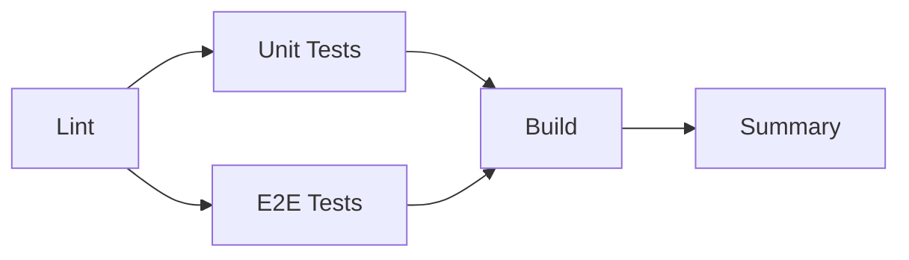

# CI/CD Setup - GitHub Actions

## 📋 Przegląd

Minimalny ale kompletny pipeline CI/CD dla projektu 10x-cards zbudowanego na:
- **Astro 5** + **React 19** + **TypeScript**
- **Tailwind 4** + **Shadcn/ui**
- **Supabase** (PostgreSQL)
- **Vitest** (testy jednostkowe) + **Playwright** (testy E2E)

## 🚀 Triggery

Pipeline uruchamia się:
1. **Manualnie** - z zakładki Actions w GitHub (przycisk "Run workflow")
2. **Automatycznie** - po każdym pushu na branch `master` lub `main`

## 📊 Pipeline Jobs



### 1. **Lint** 🔍
- Sprawdza jakość kodu używając ESLint
- Blokuje dalsze joby jeśli znajdzie błędy
- **Czas wykonania**: ~30s

### 2. **Unit Tests** 🧪
- Uruchamia testy jednostkowe (Vitest)
- Generuje raport coverage
- Uploaduje artifacts z coverage
- **Czas wykonania**: ~1-2min

### 3. **E2E Tests** 🎭
- Uruchamia testy E2E (Playwright)
- Instaluje tylko przeglądarkę Chromium (zgodnie z best practices)
- Uploaduje raporty HTML i screenshots w przypadku błędów
- **Czas wykonania**: ~2-3min

### 4. **Build** 🏗️
- Buduje wersję produkcyjną aplikacji
- Uruchamia się tylko jeśli testy przeszły
- Uploaduje build artifacts
- **Czas wykonania**: ~1-2min

### 5. **Summary** 📋
- Generuje podsumowanie całego pipeline
- Wyświetla status każdego joba
- **Czas wykonania**: ~5s

**Całkowity czas**: ~5-8 minut

## 🔧 Konfiguracja

### Wymagane GitHub Secrets

Ustaw następujące zmienne w Settings > Secrets and variables > Actions:

```bash
SUPABASE_URL=https://your-project.supabase.co
SUPABASE_ANON_KEY=your-anon-key
```

#### Jak uzyskać te wartości:

1. Zaloguj się do [Supabase Dashboard](https://supabase.com/dashboard)
2. Wybierz swój projekt
3. Przejdź do Settings > API
4. Skopiuj:
   - **Project URL** → `SUPABASE_URL`
   - **anon/public key** → `SUPABASE_ANON_KEY`

### Opcjonalne Secrets (dla testów E2E)

Jeśli używasz dedykowanego środowiska testowego:

```bash
SUPABASE_TEST_URL=https://your-test-project.supabase.co
SUPABASE_TEST_ANON_KEY=your-test-anon-key
```

## 📦 Artifacts

Pipeline zachowuje następujące artifacts (przez 7 dni):

1. **coverage-report** - Raport pokrycia kodu testami
2. **playwright-report** - Raport HTML z testów E2E
3. **test-results** - Screenshots i videos z failed testów
4. **dist** - Zbudowana wersja produkcyjna

### Jak pobrać artifacts:

1. Przejdź do zakładki **Actions**
2. Wybierz konkretny workflow run
3. Scroll na dół do sekcji **Artifacts**
4. Kliknij nazwę artifactu żeby pobrać

## 🎯 Best Practices

### Cache
- Node modules są cache'owane między jobami
- Znacznie przyspiesza instalację dependencies (~10x)

### Parallel Execution
- Testy unit i E2E uruchamiają się równolegle
- Oszczędza ~2-3 minuty na każdym pipelineu

### Fail Fast (opcjonalne)
Jeśli chcesz przerwać pipeline po pierwszym błędzie, dodaj na początku workflow:

```yaml
on:
  workflow_dispatch:
  push:
    branches:
      - master
      - main
defaults:
  run:
    shell: bash
```

### Environment Variables
- Używamy `PUBLIC_` prefix dla zmiennych dostępnych w przeglądarce
- Zmienne bez prefix są dostępne tylko server-side

## 🔍 Debugging

### Sprawdzenie logów

1. Przejdź do zakładki **Actions**
2. Wybierz konkretny workflow run
3. Kliknij na job który failed
4. Rozwiń step który pokazuje błąd

### Lokalne testowanie CI

Możesz testować kroki pipeline lokalnie:

```bash
# Lint
npm run lint

# Unit tests
npm run test:run

# E2E tests (wymaga uruchomionego serwera dev)
npm run test:e2e

# Build
npm run build
```

### Act - Uruchom GitHub Actions lokalnie

Zainstaluj [act](https://github.com/nektos/act) i uruchom:

```bash
act -j lint          # Test tylko linting
act -j test-unit     # Test tylko unit tests
act                  # Test całego workflow
```

## 📈 Monitoring

### GitHub Actions Usage

- **Free tier**: 2,000 minut/miesiąc dla repozytorium prywatnego
- **Unlimited** dla repozytorium publicznego
- Szacowany koszt: ~5-8 minut per pipeline run

### Status Badge

Dodaj badge do README.md:

```markdown

```

## 🚧 Rozszerzenia (opcjonalne)

### Deploy do DigitalOcean

Dodaj job deploy po build:

```yaml
deploy:
  name: Deploy to Production
  runs-on: ubuntu-latest
  needs: build
  if: github.ref == 'refs/heads/master'
  
  steps:
    - name: Download build artifacts
      uses: actions/download-artifact@v4
      with:
        name: dist
    
    - name: Deploy to DigitalOcean
      # Dodaj tutaj swoje kroki deployment
```

### Notification (Discord/Slack)

Dodaj na końcu summary job:

```yaml
- name: Notify Discord
  if: always()
  uses: sarisia/actions-status-discord@v1
  with:
    webhook: ${{ secrets.DISCORD_WEBHOOK }}
```

### Dependency Review

Dodaj job sprawdzający bezpieczeństwo dependencies:

```yaml
dependency-review:
  runs-on: ubuntu-latest
  steps:
    - uses: actions/checkout@v4
    - uses: actions/dependency-review-action@v4
```

## 💡 Tips

1. **Zawsze testuj lokalnie przed pushem** - oszczędzi to czas i minuty CI
2. **Używaj draft PRs** - jeśli pracujesz nad feature i nie chcesz uruchamiać CI
3. **Branch protection** - wymagaj przejścia CI przed mergem do mastera
4. **Scheduled runs** - rozważ codzienne uruchomienie testów (np. o 6 rano)

## 📚 Dodatkowe Zasoby

- [GitHub Actions Documentation](https://docs.github.com/en/actions)
- [Playwright CI Guide](https://playwright.dev/docs/ci)
- [Vitest CI Guide](https://vitest.dev/guide/cli.html#ci)
- [Astro Deployment](https://docs.astro.build/en/guides/deploy/)

---

**Status**: ✅ Production Ready
**Last Updated**: 2025-10-28
**Maintainer**: DevOps Team
